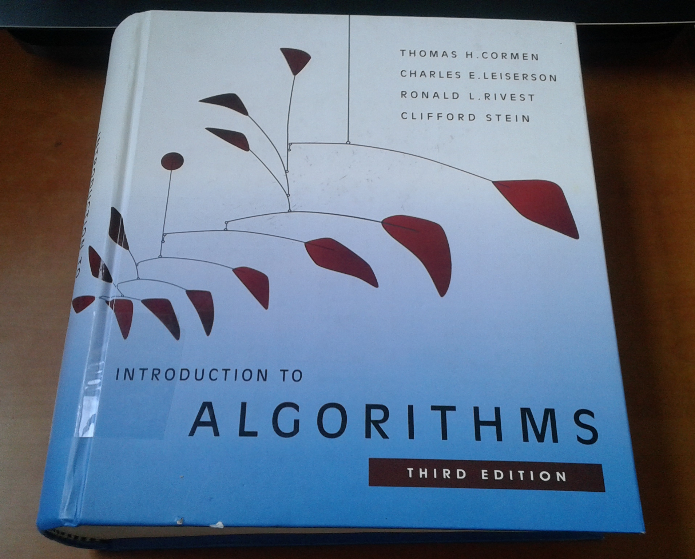

# common_algorithms_and_data_structures

these are the most common algorithms and data structures that I think every programmer should know

If you are new to programming, then this repo is your starting point to become a better programmer.

# how to use this repository?

According to the list below, start reading the readme of each part and try to write a code for that algorithm or data structure. After that (or if you couldn't write the code yourself) check my codes.

If your code is better than mine or yours is in another language that does not exist here, please create a pull request and add your codes.

Also if you know another algorithm or data structure that was not in here, create a pull request and add it to this repo.

I will be happy while merging pull requests :)

## Table of Contents (in order of increasing difficulty)

- [Data structures](./data_structures)
  - [Stack](./data_structures/stack_structure)
  - [Queue](./data_structures/queue_structure)
  - [Linked list](./data_structures/linked_list_structure)
  - [Binary tree](./data_structures/binary_tree_structure)
  - [Array](./data_structures/array_structure)
  - [Graph](./data_structures/graph_structure)
- [Search algorithms](./search_algorithms)
  - [Linear search](./search_algorithms/linear_search)
  - [Depth first search](./search_algorithms/depth_first_search)
  - [Binary search](./search_algorithms/binary_search)
  - [Breadth first search](./search_algorithms/breadth_first_search)
- [String operations](./string_operations)
  - [Palindrome](./string_operations/palindrome)
  - [Match parentheses](./string_operations/match_parentheses)
  - [Longest palindromic](./string_operations/longest_palindromic)
- [Sorting algorithms](./sorting_algorithms)
  - [Bubble sort](./sorting_algorithms/bubble_sort)
  - [Merge sort](./sorting_algorithms/merge_sort)
- [Recursive algorithms](./recursive_algorithms)
  - [Factorial](./recursive_algorithms/factorial)
  - [Fibonacci](./recursive_algorithms/fibonacci)
  - [Sudoku solver](./recursive_algorithms/sudoku_solver)
- [Path finding algorithms](./path_finding_algorithms)
  - [Maze (DFS)](./path_finding_algorithms/maze_dfs)
  - [Graph shortest path (BFS)](./path_finding_algorithms/bfs_shortest_path.py)

# Contributing

Feel free :)

# References

The main reference is this book :

